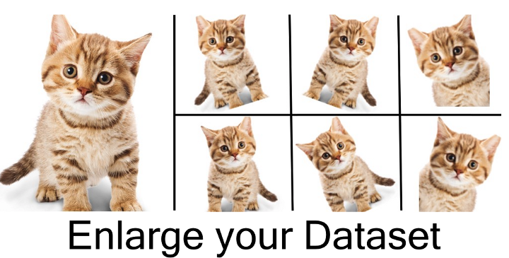

## AlexNet(2012) 논문 리뷰
---
현재 객체 인식 기술에서 머신러닝은 필수라고 볼 수 있습니다.  
가변적 문제 해결을 위해서는 많은 양의 데이터를 필요로 하며 ImageNet등에서  
overfitting을 예방할 정도로 많은 양의 데이터 확보가 가능하게 되었습니다.  
학습 모델은 CNN을 사용하며, 2개의 GPU를 병렬 연결하여 사용합니다.

### Dataset
---
ImageNet의 dataset은 1500만개 이상의 고해상도의 레이블된 data이며 22000개의  
레이블이 존재합니다. 이러한 이미지를 사용하여 256x256x3으로 다운 샘플링해 사용  
하며, 만약 이미지의 크기가 작을 경우 crop기법을 사용하여 사용합니다.

### Architecture
---
기존에는 활성화 함수롤 sigmoid혹은 tanh를 사용했습니다. 하지만 이러한 함수들은  
딥러닝에 적합하지 않습니다. 이러한 이유로 고안된 활성화 함수가 바로 ReLU입니다.  
기존은 활성화 함수보다 목표 error-rate에 도달하는 속도가 빠르며 경사 하강 알고리  
즘에서 유리하고 overfitting 감소에 장점을 가집니다.  

### Multiple GPUs
---
GPU메모리의 크기는 네트워크 성능을 제한합니다. 그렇기에 해당 논문에서는 2개의  
GPU를 병렬 연결하여 사용하였고, 각 GPU마다 Kernel의 절반을 배치하였으며 아래와  
같이 사용된다. 이를 통해 error-rate 감소의 성과를 이루었다.

### Local Response Normalization
---
정규화가 일반화에 영향을 준다는 것을 알아냈다.  
k = 2, n = 5, α = 10−4, β = 0.75 는 여러 연구를 통해 알아낸 최적의 수치이며, 이는  
하이퍼 파라미터(사용자가 직접 값을 지정하는 파라미터)입니다.

### overlapping pooling
---
pooling을 진행할 경우 s = stride, z = filter size이면 tranditional pooling s < z 라면  
overlapping pooling이라고 칭합니다. 해당 모델에서는 s=2, z=3을 사용하였고, s=2, z=2를  
사용한 모델과 비교하였을 때는 error-rate를 0.3~0.4%정도 감소 시켰습니다. s < z인 경우  
중첩이 생기며 이 중첩으로 인하여 인접 픽셀들의 특징을 더 잘 확인할 수 있게 됩니다.

### overall Architecture
---
현재는 총 8개 Layer로 구성된 구조이며, 출력층에는 활성화 함수로 softmax를 사용하여 1000개의  
클래스를 구현하였습니다. 

### Data Augmentation
---
데이터 증식을 위해서는 256x256의 image에서 224x224의 image를 추출하였으며 한장의 사진에서  
서로 다른 사진 5장을 추출합니다. 이후 수평반사로 1개의 image에서 서로다른 10장의 image를  
추출한 후 softmax 출력층에서 10개 image의 예측값 평균을 구하는 방식입니다.

### Dropout
---
50% 확률로 신경망을 꺼지게 합니다. 단 학습과정에서만 dropout을 사용할 뿐, 테스트 과정에서는  
dropout 과정을 거치지 않습니다. dropout을 거친 부분은 다음 뉴런에 영향을 주지 못하여  
이를 통해 overfitting을 줄이기 때문입니다. dropout 확률을 너무 적게 준다면 학습에 왜곡  
이 생길 수 있기에 적당한 값을 주어야 합니다.

### Result
---

결과는 위와 같이 CNN이 다른 모델에 비해 효율적임을 알 수 있고, 앙상블 모델을 이용한 성능이  
1개의 CNN 모델만 사용하는 것 보다 좋은 결과를 가진다는 것을 알 수 있다. fine-tune이  
적용된 모델이 처음부터 가중치를 학습시키는 것 보다 좋다는 것을 알 수 있습니다.