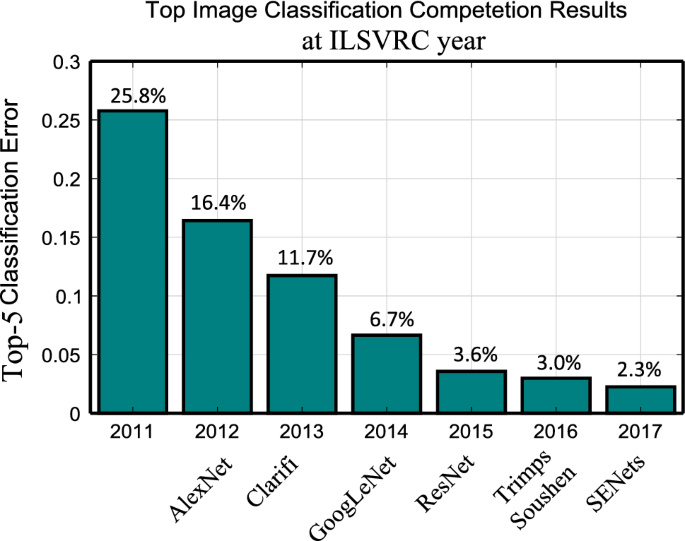
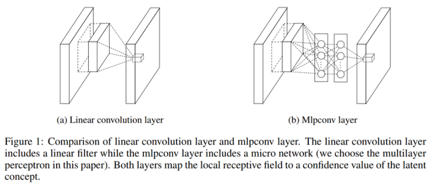
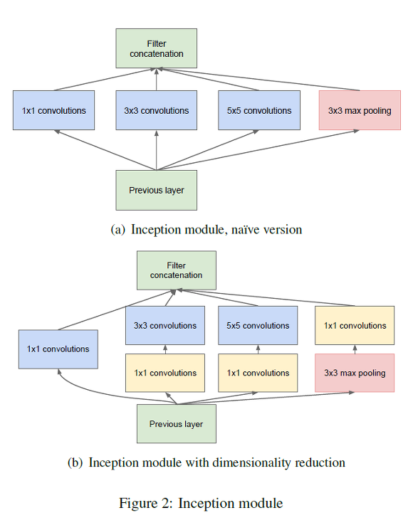
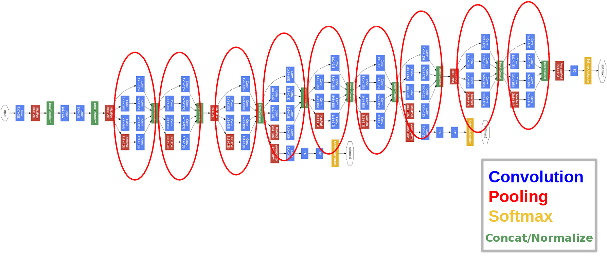
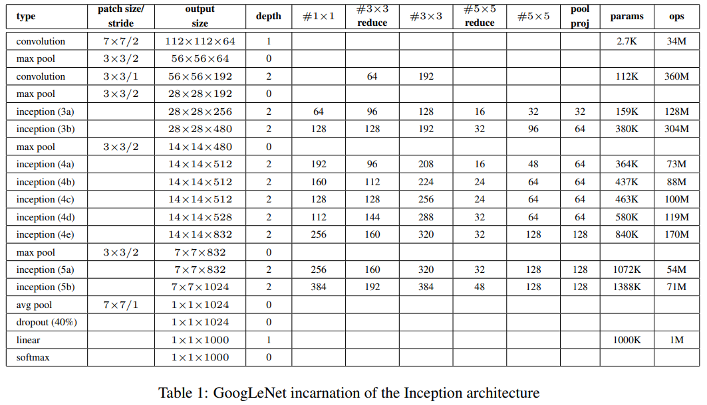
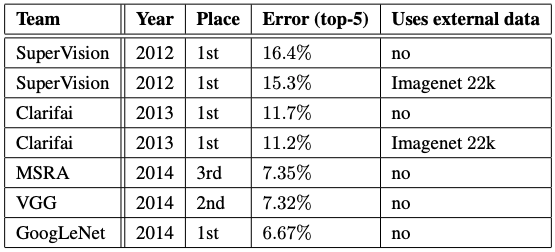

## GoogLeNet(2014) 논문 리뷰
---
LeNet-5를 시작으로 CNN은 이미지 분류에서 일반적인 구조가 되었다. CNN 구조에 Dropout, ReLU,  
Maxpooling, GPU 기법 등이 적용된 AlexNet이 2012 ILSVRC 대회에서 우승을 차지하고 CNN을 세상  
널리 알리게 됩니다. 2년뒤 Inception block을 적용한 CNN 모델인 GoogLeNet이 2014 ILSVRC 대회  
에서 우승을 차지하게 됩니다.

  

### GoogLeNet?
---
GoogLeNet은 22층을 가진 DeepNeuralNetwork이다. neural network는 깊이와 너비가 증가할 수록 더  
높은 정확도를 얻을 수 있지만, 두 가지 단점을 가지고 있다. 첫째, 기하급수적인 파라미터의 증가  
이다. 파라미터 수가 많아지면 network는 overfitting을 하기 쉬워지고 bottleneck을 만들게 된다.  
이는 network의 깊이와 크기를 증가시키는데 제한을 두게 된다. 두 번째 메모리 사용량이 증가한다.  
계산 용량은 유한하므로 계산 자원의 효율적인 분포가 필요하다.  

이 논문에서는 알고리즘을 메모리 용량이 제한되어 있는 모바일이나 컴퓨터에 embedded 하기 위해  
효율적인 neural network 구조를 만들어야 한다고 주장한다. 실제로는 AlexNet 보다 정확도는 뛰어  
나지만 파라미터 수가 12배 적은 모델을 구축하게 된다.  

어떻게 AlexNet보다 가벼우면서 정확도가 뛰어난 모델을 구축할 수 있는걸까?  

### GoogLeNet의 철학
---
GoogLeNet은 sparse한 data구조에 집중한다. 위에서 서술한 두 가지 문제를 해결하기 위해서는 sparse  
하게 연결된 구조가 필요하다고 말한다. 이를 위해 NIN(Network In Network) 논문을 인용한다.  

NIN은 높은 상관관계에 있는 neuron들을 군집화 시키고 마지막 계층에서 활성화 함수들의 상관 관계를  
분석함으로써 최적의 network topology를 구축할 수 있다고 말한다. 이를 간단히 표현한다면, convolution을  
수행 할 때, 수행 후 feature map을 얻게 되는데, multilayer perceptron 네트워크를 convolution시 추가로  
적용하여 feature map을 만든다.  

  

이를 통해 fc layer와 conv layer를 dense한 구조에서 sparse한 구조로 바꿀 수 있다고 말한다. GoogLeNet에  
서는 NIN 구현을 위해 Inception module을 적용한다.  

하지만 sparse한 데이터 구조는 단점이 존재한다. 불균일한 sparse한 데이터에서 수치 계산은 매우 비효율적  
이다. dense 데이터는 꾸준히 개선되며 고도로 조정된 라이브러리와 CPU or GPU의 사용으로 빠르게 계산할 수  
있는 반면에 sparse 데이터를 다루는 연산의 발전은 미미했다.  

그렇기에, dense data구조를 sparse한 구조로 바꾸어서 효율적인 데이터 분포를 만들어 낸다면, 더 깊고 넓으  
면서 정교한 network를 만들 수 있다.  

### Incpection Module
---

Incpection module의 주 목적은 conv-network에서 sparse 구조를 쉽게 dense 요소들로 근사화하여 다루기 위함  
이다.  

Inception module에서 feature map을 효율적으로 얻기 위해 1x1, 3x3, 5x5의 conv 연산을 수행하며, 각각 matrix  
의 height, width가 같아야 하므로 pooling 연산에서 padding을 추가해준다. pooling을 적용하는 이유는 conv-net  
work에서 pooling-layer의 성능이 입증되었기 때문이다.  

  

위의 사진에서 Inception module을 보면 1x1 convolutions이 보이는데, 이것이 inception module의 핵심이다.  
1x1 convolution의 목적은 dimension reduction을 실행하여 필요 연산량을 감소 시키는 것이다. 3x3와 5x5의  
convolution 연산 이전에 1x1 convolution이 적용되었는데 이는 dimension reduction을 통해 input filter의  
수를 조절하기 위함입니다. 예를 들어, 이전 layer에서 512개의 channel을 가진 output이 생성되었다면, 256개  
의 1x1 convolution filter를 이용해서 256 channel로 줄일 수 있다. 이를 통해 다양한 filter를 적용하여 여러  
특징을 추출하지만 연산량을 낮출 수 있게 된다.  

모든 layer에 inception module을 적용한다고 해서 좋은것 뿐만은 아니다. 낮은 layer에서는 conv-layer를 적용  
하고, 높은 layer에서는 inception module을 사용하는 것을 권장한다.  

### Inception Module 요약
---

- 계산 복잡도에서 조절되지 않는 폭발없이 각 단계에서 unit의 수를 상당히 증가시킬 수 있다. dimension red  
uction을 통해 다음 계층의 input 값을 조절할 수 있기 때문이다.

- visual 정보가 다양한 규모로 처리되고 다음 계층은 동시에 서로 다른 규모에서 특징을 추출할 수 있게 된다.  
1x1, 3x3, 5x5 convolution 연산을 통해 다양한 특징을 추출할 수 있기 때문이다.

### GoogLeNet Architecture
---
다음은 Inception module을 통해 다양한 feature(특징)을 추출하고 parameter 연산량을 개선한 모델이다.  

  

또한 아래의 사진은 전체 구조에 대한 상세한 구성이다. 각 convolution에는 relu가 적용되었으며, optimizer는   
0.9 momentum을 지닌 SGD를 사용합니다. 매 8 Epoch마다 4% 학습률을 낮춰서 진행합니다.  

  

모델의 깊이가 굉장히 깊은 것을 알 수 있고, 이는 곧 gradient vanshing 문제가 발생할 수 있기 때문에 중간에  
효과적인 기울기 전달을 위해 auxiliary classifier를 중간 layer에 추가했다.  

auxiliary classifier의 등장배경은 이러합니다. 상대적으로 얇은 신경망의 강한 성능은 신경망의 중간 layer  
에서 생성된 특징이 매우 차별적이라는 것을 나타낸다. 이 중간 계층에 auxiliary classifiers를 추가하여  
낮은 단계에서 차별점을 이용할 수 있고, 뒤로 전달되는 기울기 신호를 증가시키고 추가적인 regularization  
효과를 기대할 수 있다.  

### Result
---
  

위에서 볼 수 있듯 2등이였던 VGGNet에 비해 거의 1% Error율을 줄인것을 볼 수 있으며 ILSVRC 2012 ~ 2014   
이래로 가장 낮은 Error율을 나타낸다는 것을 알 수 있다.