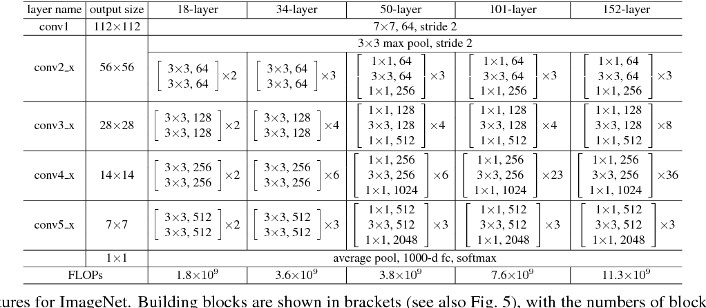

## ResNet(2015) 논문 리뷰
---

ResNet은 2015년 ILVSRC 대회에서 1등을 한 모델이다. ResNet은 수학적으로 어려운 개념보다는  
방법적으로 신박한 residual(잔차)라는 개념이 적용되었다. Residual이란 결과의 오류 정도를 이야기  
한다. 간단하게 Y(전체 문제)에서 X(맞은 답)를 뺀 나머지라고 생각하면 된다. 이전에는 residual을  
평가의 기준에만 사용했지만, MS에서는 residual을 학습하는데 이용하였다. 그 결과 ILSVRC 2015에서  
1위를 차지 하였다. 2014년 우승 모델인 GoogLeNet보다 약 130개의 layer가 증가하였다. 그 이유를 밑  
에서 알아보자.

  

### Abstract
---

첫 부분에서는 depth의 중요성과 residual learning에 대해 간략하게 설명한다. ILVSRC 대회를 보면 depth의  
깊이가 모델의 성능에 큰 영향을 준다는 것을 알 수 있다. 하지만 depth가 올라감에 따라 문제도 생긴다. 바로  overfitting,  
gradient의 소멸, 연산량 증가 등이 있다. 따라서 심층 신경망은 학습시키기 굉장히 까다롭다. 이에 MS  팀에서는 residual  
learning framework를 사용하여 이전보다 훨씬 더 깊은 네트워크를 안정적으로 학습 시킬 수 있다고 말했다.

### Introduction
---

심층 신경망은 추상화에 대한 low / medium / high level의 특징을 classifier와 함께 multi-layer 방식으로 통합  
한다. 추상화 level은 쌓인 layer의 수에 따라 더욱 높아질 수 있다. 즉 높은 추상화 특징은 high layer에서 파악 할 수  
있다.  

  

연구 결과에 따르면 네트워크의 깊이는 매우 중요한데, 실제로 많은 네트워크 모델들이 네트워크의 깊이를 더 높게 쌓을  
수록 더 좋은 성능을 보여줬다고 한다. 그렇지만 네트워크의 깊이가 깊어질 수록 장점만이 존재하는 것은 아니다. 네트워크  
의 깊이가 깊어지면 gradient vanishing, Exploding gradient와 같은 현상이 일어난다.  

심층 신경망의 경우에는 성능이 최고 수준에 도달 할 때 degradation 문제가 발생한다. 이는 네트워크의 깊이가 깊어짐에  
따라 정확도가 포화하고, 급속하게 감속하는 것을 의미한다. 이러한 원인은 오버피팅이 아니라 그저 layer의 수가 더 늘어났기  
때문인데 test error 뿐만아니라, training error도 함께 늘어났기 때문이다. 이는 곧 서로 다른 system들이 최적화 하는 방식이  
다르다는 것을 이야기 한다.  

그렇다고 해서 해결책이 없는것은 아니다. 바로 추가된 레이어가 identity mapping이며, 추가되지 않은 다른 레이어들을 더 얕은  
모델에서 학습된 layer를 사용하는 것이다. 이러한 조건에서의 기존의 모델의 training error가 더 얕은 모델보다 낮아야 한다는 것  
이다. 이 기술을 MS팀이 적용한 것이다.  

기존의 신경망에서는 입력(x)를 받고 H(x)를 거쳐 y를 출력하는데 resnet의 residual은 H(x)가 출력과 입력의 차이인 H(x) - x를  
얻도록 하는 것이다. 즉 출력과 입력의 차를 줄인다는 뜻이다. 이는 곧 H(x)를 x로 mapping 하는 것을 의미한다.  

### Related work
---

벡터 양지화에 있어 residual vector를 인코딩하는 것이 original vector보다 훨씬 더 효과적이다는 것이다. 벡터 양지화란 feature x를  
class y로 mapping 하는 것을 말한다.

### Architecture
---
  

ResNet은 VGGNet에서 영향을 받았기 때문에 plain net을 만들었으며 동일한 feature map size를 갖게하기 위해 layer에서 3*3  
filter를 사용하였고 stride 2로 downsampling을 할 때에는 channel 수를 2배로 늘려 time complexity를 유지했다.  

마지막 conv-layer의 output은 global average pooling을 통해서 pooling하고 그 결과를 fc-layer를 통해 class 개수만큼  
출력으로 변환 후 activation function으로 softmax를 사용하였다.  

VGG에 비해 펄터의 개수를 낮추어 parameter의 수를 줄였고 복잡도를 낮춰 연산량도 감소했다.

### Implementation
---

- Scale Augmentation: 256 ~ 480 size로 random size, 각 이미지 마다 224 x 224로 random crop 혹은  
상하로 뒤집은 10장의 데이터 사용

- Color Augmentation: AlexNet에서 사용한 방식 채택
- Batch Normalization: 활성화 함수와 Conv layer 사이에 적용
- Mini Batch: 256
- Learning Rate: 0.1 (에러율 변화가 없다면 1/10 감소)
- Iteration: 60 x 19^4
- Decay & Momentum: 0.0001, 0.9
- Dropout: 없음

### Result
---
  

18, 34-layer를 보면 resnet의 optimization이 쉽다는 것을 알 수 있다. 또한 50 이상부터는  
구조가 조금 바뀐것을 알 수 있는데, 이는 layer가 늘어날수록 parameter가 많아지게되며 FLOP  
수가 늘어나 연산량이 많아지게 되어 complexity가 높아져 이를 해결하기 위해 bottleneck을  
사용하였다.  

Bottleneck은 기본적으로 연산량을 줄이기 위해 사용하며, GoogLeNet의 Incpection Module의 구조  
처럼 demension을 줄이기 위해 1x1 conv를 통해 channel수를 줄였다가 3x3 conv를 거친 후 다시  
1x1 conv를 통해 channel 수를 늘려주는 방식으로 연산량을 줄여 complexity도 낮추고 추가로 ReLU  
도 추가로 수행하여 학습에 도움을 준다.