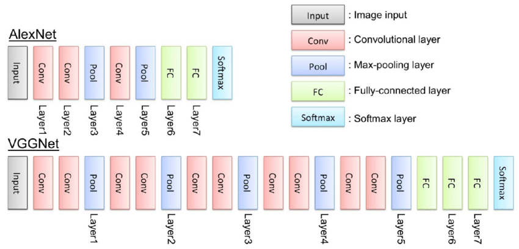
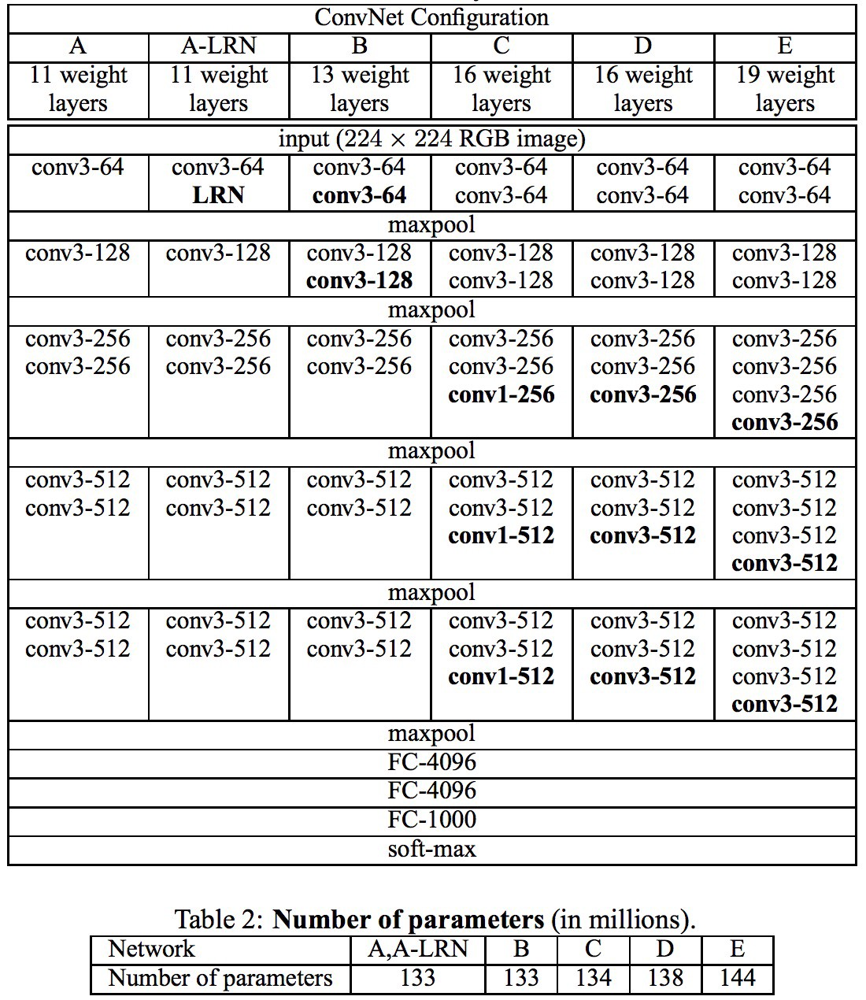

## VGGNet(2014) 논문 리뷰
---
VGGNet은 ILSVRC 2014 대회에서 2등을 차지한 CNN 모델이다. 1등 보다 2등을  
했던 VGGNet이 더 각광 받았던 이유는 VGGNet이 네트워크의 깊이가 모델이 좋은  
성능을 보이는데 중요한 역할을 한다는 것을 증명해냈기 때문이다. 비록 ILSVRC 대회  
에서는 1등인 GoogLeNet보다 이미지 분류 성능이 낮았지만, 다른 연구들에서는 더 좋  
은 성능을 보여주었다. 최근에는 이미지의 feature를 추출하는데 사용되는 기본 네트워크  
모델로 활용이 되고 있다. 

### Introduction
---
본 연구는 2012년 AlexNet을 통해 영상 및 비디오 인식에서 뛰어난 결과를 보고, 네트워크의  
깊이가 인식 결과에 영향을 미친다는 것을 증명하기 위해 시작된 연구이다.

### vs AlexNet
---
VGGNet은 기존에 존재하던 AlexNet(8-layers)모델보다 깊이가 2배 이상 깊은 네트워크 학습에  
성공하였으며, 이를 통해 기존의 AlexNet의 오차율(16.4)를 절반인 오차율(7.3)으로 줄였다.  
VGGNet이 깊은 네트워크를 학습할 수 있었던 이유는 바로 모든 Conv-layer에서 3x3 필터를 사용  
했기 때문이다.

### VGGNet Architecture
---

VGGNet의 Architecture의 구성

- 13 Conv-layers + 3 FC-layer
- 3x3 Conv filters
- stride: 1 & padding: 1
- 2x2 max pooling(stride: 2)
- Activation Function: ReLU

### Experiment result
---

input_size는 224x224 크기의 컬러 영상을 사용하며, 한개 혹은 여러개의 max-pooling 층이 반복되는  
구조이고, 마지막으로 FC layer가 구성되어 있다. 기존의 7x7 filter를 사용하지 않고 3x3 filter를  
사용하여 상당수의 파라미터를 줄일 수 있었지만, 마지막 FC layer로 인하여 상당수의 파라미터가 존  
재한다. VGGNet의 가장 큰 단점은 위에서 말한것과 같이 파리미터가 너무 많이 존재한다는 것이다.  
당시 ILSVRC 대회에서 1등을한 GoogLeNet의 파라미터가 5백만개인것에 비해 VGGNet은 133백만개나 존  
재하였다. 참고로 GoogLeNet에는 FC layer가 존재하지 않는다.

### Why use 3x3 filter
---

VGG 모델 이전에 Conv를 통해 이미지 분류에서 좋은 성과를 거두었던 모델들은 비교적 큰 Respective Field를  
갖는 11x11혹은 7x7의 필터를 포함했다. 그렇지만 VGGNet은 오직 3x3 filter만으로 이미지 분류 정확도를  
개선 시켰다. 또한 7x7의 파라미터 개수는 49이며, 3x3의 파라미터 개수는 27이 된다. 이점에서 파라미터가  
크게 감소하는 것을 알 수 있다. 또한 무작정 네트워크의 깊이를 깊게 쌓는다고 해서 장점만이 존재하는 것  
은 아니다.

### Result
---

VGGNet은 구조가 간단하여 이해 및 변형이 쉽다는 장점을 가지고 있지만, 방대한 파라미터의 양 때문에 학습  
시간이 오래걸린다는 단점이 존재한다.