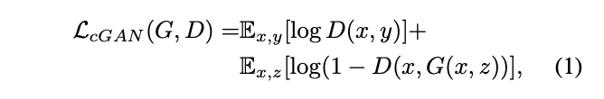
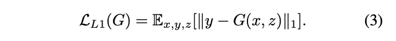
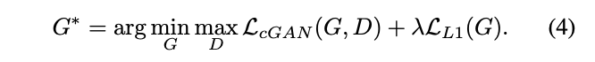
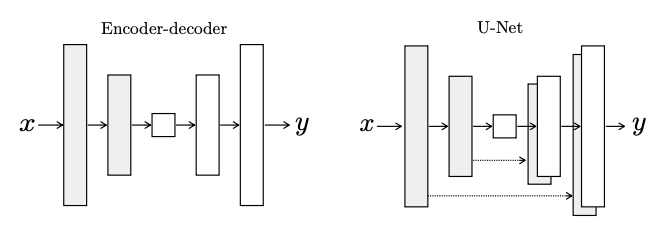
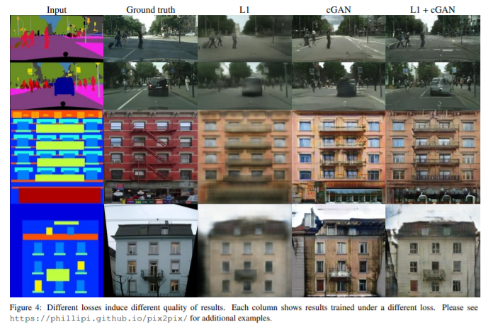
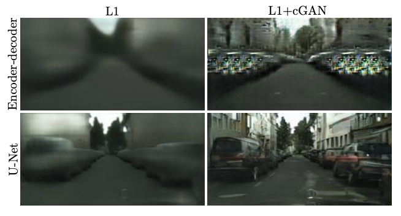
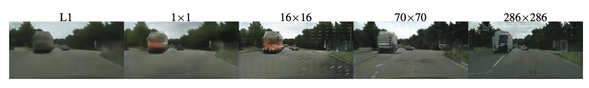

## Image-to-Image Translation with Conditional Adversarial Networks(2016) 논문 리뷰
---
이미지 처리, 그래픽 및 비전의 많은 문제들은 input_image를 output_image로 변환하는 것과 관련이 있다.  
위와 같은 문제는 설정이 항상 동일하더라도 응용 프로그램 별 알고리즘으로 처리되는 경우가 많다. 우리는  
같은 아키텍쳐와 방법으로 다른 데이터에 대해 간단하게 학습 할 수 있다.

  

우리는 CGAN을 이용하여 한 유형의 이미지를 다른 유형의 이미지로 변환할 수 있는 framework를 제시했다.  
GAN을 사용하기 때문에 L1, L2 loss를 사용할 때보다 더 선명한 이미지를 얻을 수 있다. 또한 L1 loss를 사용  
했기 때문에 pixel 간의 관계를 고려한 scturcted loss 개념도 적용되었다.  

이미지의 빈 영역을 잘 채우려면 대상 영상의 semantic을 정확하게 이해해야 한다. 그러나 L1, L2 loss만으로는  
복원 영상이 불선명해지는 현상을 피할 수 없다. 이 문제 해결을 위하여 Adversarial Loss를 사용 할 것이다.  

### Methods
---
밑에서는 pix2pix에서 사용되는 함수들에 대하여 알아 볼 것이다. Pix2Pix에는 이미지가 진짜 이미지인지를 나타  
내는 Adversarial Loss, 생성된 이미지가 gt와의 유사도를 나타내는 Reconstruction Loss가 존재한다.  

  

위의 함수는 이미지가 진짜 이미지인지 나타내는 Adversarial Loss이다. cGAN의 loss와 매우 유사하다.  
Generator는 입력 이미지 x를 넣으면 출력 이미지 y가 생성이 된다. 기존 GAN과 달리 noise z를 넣지 않는다.  
Discriminator에는 입력 영상 x와, 생성된 영상 G(x) 혹은 원래 영상 y가 같이 들어가서, 이미지가 진짜인지  
가짜인지 구분한다.  

  

Reconstruction Loss는 L1 loss인데, 생성된 이미지와 ground truth와의 유사한 정도를 나타낸다.  
Discriminator가 가짜 이미지를 판별하는 역할을 그대로 둔 채로, Generator가 실제와 더 유사한 이미지를 생성  
할 수 있도록 사용한다. Context Encoder와 달리 L1 loss만 사용했는데, L2 loss를 사용했을 때보다 이미지가  
덜 흐릿했기 때문이다.  

  

pix2pix의 최종 loss fn은 위의 두 loss를 합친 값이다.

### Network Architecture
---
pix2pix의 Generator와 Discriminator 모두 DCGAN의 구조를 기본으로 변형해서 사용한다. 또한 Generator, Discri  
minator 둘 다 convolution-layer -> BatchNorm -> ReLU의 형태를 띈다.  

  

위와 같이 Generator는 두 가지 아키텍쳐가 존재한다. 기존의 Encoder-Decoder 구조와 Encoder, Decoder 스택  
안에 mired layer사이에 skip connection이 있는 encoder-decoder 구조이다. Generator의 Encoder와 Decoder를  
합치면 bottleneck 구조의 모델로 볼 수 있다. Pix2Pix는 고해상도 이미지를 고해상도 이미지로 변경하기 때문  에 input  
이미지에 있던 이미지의 색상이나, edge의 위치 등의 low-level 정보가 보존될 필요가 있다. 따라서 같은 level을 가진  
encoder의 layer와 decoder의 layer간에 skip connection을 추가한다. (layer가 n개 존재한다면, i번째  layer의 n-i번째  
layer간에 skip connection이 존재한다.)  

L1, L2 loss를 사용하면 이미지가 흐릿해진다는 현상이 보고 되었습니다. 그렇기에 GAN의 Discriminator는 high-  
frequency structure만을 모델링하도록 제한하고, low-frequency correctness는 L1 loss에서 담당한다.  

### Results
---

  

위의 사진을 보면 각 loss_fn에 따른 결과의 차이를 볼 수 있다.  

L1 loss만을 사용해도 충분히 잘 나왔지만, 매우 흐릿한 이미지가 생성이 되었다. cGAN loss만을 사용하면 이미지가  
선명하지만, gt에 없던 구조물들이 추가로 생성되는 문제가 발생한다. lambda 값을 100으로 주어 두 loss를 둘 다  
사용했을 때, gt에 없던 구조물들이 추가로 생기는 것을 막고, 선명한 이미지를 출력할 수 있다.  

CGAN은 선명한 이미지를 만들려고 하는 경향이 있기 때문에 input label map에도 없는 것들을 만들어내기도 한다.  
한편, L1은 불명확한 점이 있으면 흐릿해지는 경향을 가지고 있어, 색상들이 평균적으로 수렴해서 회색에 가까운   
색상이 많이 나온다. 하지만 CGAN을 함께 사용하면 색상의 분포가 gt에 가깝도록 조정되어 색상이 더 다양해진다.  
또한 Skip connection을 사용하면 생성된 이미지 품질이 더 향상된다.  

  

UNet의 구조는 low-level 정도를 network간에 전달하는 shortcut이다. L1 loss만 사용했을 땐 shorcut을 사용  
한다고 해서 이미지가 크게 좋아지지 않았지만, cGAN까지 사용할 경우 이미지의 품질이 크게 증가하는 것을  
알 수 있었다. 

  

위의 사진처럼 patch_size는 70x70을 사용한 결과가 가장 좋았습니다.  

### 체험
---
아래의 사이트를 이용하여 pix2pix를 체험해 볼 수 있다.  

[pix2pix](https://affinelayer.com/pixsrv/)