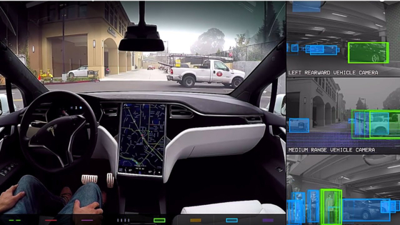

## 최근 딥러닝 5가지 사례

---
최근 데이터 분야에서 가장 Hot한 주제는 **딥러닝**이라고 생각합니다.  
2016년 알파고 이후부터 딥러닝에 대한 사람들의 관심이 급격히 증가한것 같습니다.  
아래의 5가지 사례로 최근 딥러닝의 발전 속도를 알려드리려고 합니다.  

### Google Duplex
---

- [영상링크](https://www.youtube.com/watch?v=D5VN56jQMWM&t=167s)
- 구글 I/O 컨퍼런스에서 발표한 인간 상대방과 자연스럽게 통화하는 구글 튜플렉스입니다.
- 구글 어시스턴트의 확장 프로그램으로 여러 업무를 시킬 수 있습니다.
- 구글 어시스턴트에게 "오후 8시에 레스토랑 예약해줘"라고 말하자 직접 전화를 걸어 예약합니다.
- 예약 과정에서 으흠과 같은 추임새도 중간에 들어가 진짜 사람 같습니다.

### 책 읽어주는 딥러닝
---

- [영상 링크](https://www.youtube.com/watch?v=klnfWhPGPRs)
- 김태훈님의 DEVIEW 2017 발표 영상입니다.
- 음성 합성이 어디까지 발전했는지 알 수 있습니다.
- 오픈소스가 Github에 공개 되어 참고해도 좋을 것 같습니다.

### Tesla 자율주행
---

- [영상 링크](https://www.youtube.com/watch?v=LskKnoWI5Ro)
- Tesla의 자율주행 영상입니다.
- YouTube에 Tesla Autopilot이라고 검색을 하면 최신 영상을 볼 수 있습니다.
- 위의 영상은 3년전 영상으로 3년간 기술이 얼마나 발전했는지 비교하기 위함입니다.

### 네이버 웹툰(마주쳤다)
---

- [기사 링크](https://www.naverlabs.com/storyDetail/44)
- 웹툰에 이미지 생성 기술의 한 종류인 GAN을 적용하였습니다.
- 네이버 웹툰에서도 딥러닝을 제품에 적용하려는 노력을 하고 있습니다.
- 2017년에 나온지라 제대로 내 얼굴을 웹툰으로 구현은 불가능합니다.

### 의료 산업
---

- [기사 링크](https://cm.asiae.co.kr/article/2020100322152301304)
- AI를 통해 코로나 19 선별 및 패혈증 12시간 조기 예측이 가능합니다.
- 인간보다 10배 빨리 코로나 19 환자를 선별 할 수 있습니다.
- 이로 인해 코로나 19 확산을 조금이나마 늦출 수 있습니다.