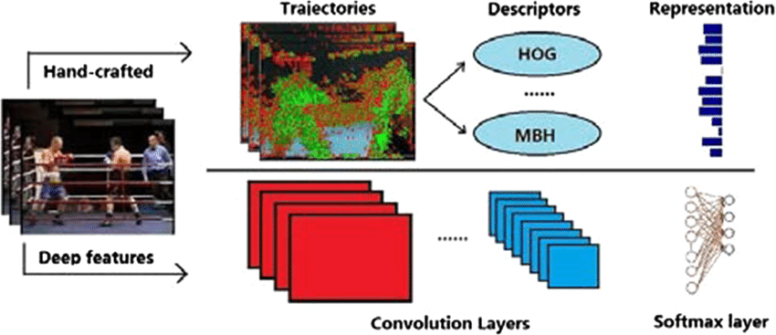
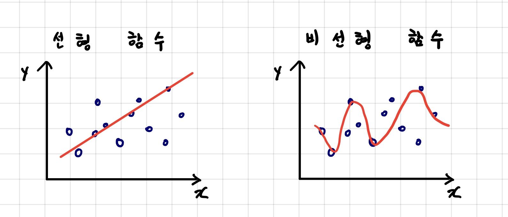

## 머신러닝과 딥러닝의 차이

---
최근 인공지능을 공부하는 사람들이 늘어나고 있는 추세이다.  
딥러닝은 잘 알고 있지만, 머신러닝은 공부를 하지 않는 것 같아 간략하게 둘의 차이점을 작성해보려고 한다.

### Feature(특징)
---

- 머신러닝
    - 위의 사진에서 Traiectories를 보면 사람이 직접 edge에 점을 찍은것을 볼 수 있다.
    - feature를 사람이 직접 추출해야 한다.
    - 이에 따라 사람마다 feature를 추출하는 기준이 불분명하다.
    - 주로 모델은 주어진 대상을 분석할 때 인간이 주어진 feature를 중심으로 분석한다.
    - feature가 특정 이미지에만 속한되어 다른 이미지에 모델을 적용하면 분류를 할 수 없다.

- 딥러닝
    - 위의 사진에서 빨간색 상자를 보면 자동으로 추출된 feature를 볼 수 있다.
    - 신경망이 자동으로 feature를 추출한다.
    - 어느부분이 feature로 쓰였는지 알 수 없다.
    - 머신러닝에 비해 feature의 개수가 훨씬 많다.

### 선형과 비선형(linear vs non-linear)
---

- 머신러닝
    - 위의 사진처럼 머신러닝은 비선형 함수를 구현할 수 없기 때문에 분류 성능이 현저히 떨어진다.
    - linear를 몇백, 몇천개 쌓아도 비선형 함수가 될 수 없다.

- 딥러닝
    - 딥러닝은 비선형 함수를 구현 할 수 있기 때문에 분류 성능이 머신런닝에 비해 훨씬 높다.
    - linear -> activation function 을 순차적으로 쌓고 input과 output shape을 정의하면 딥러닝을 구현 할 수 있다.